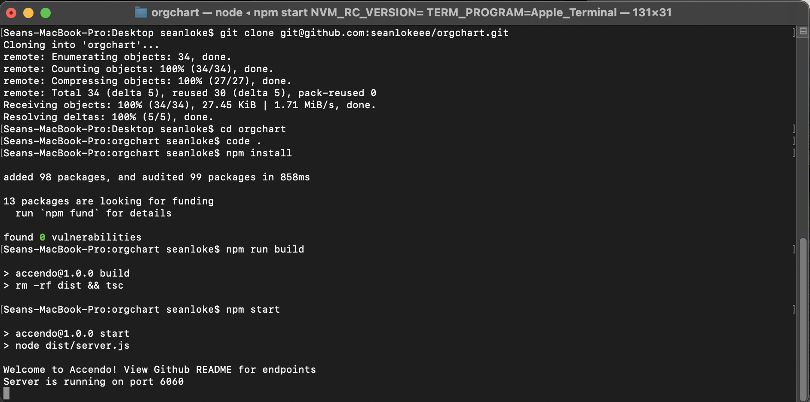
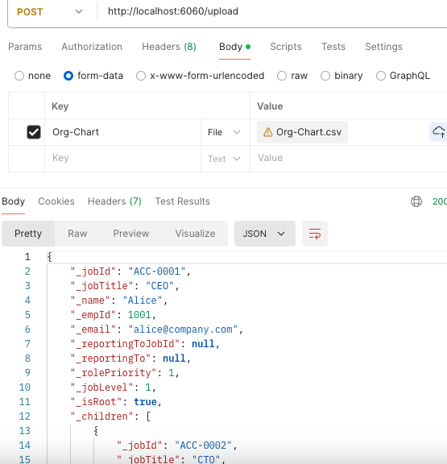
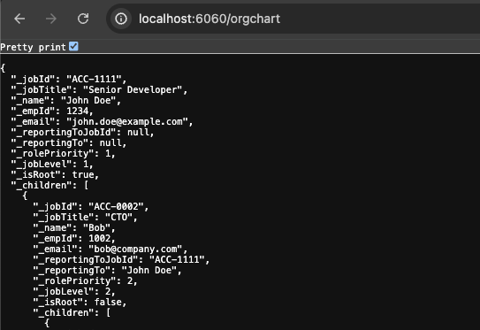
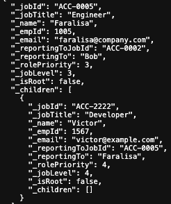
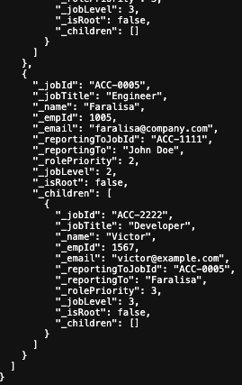
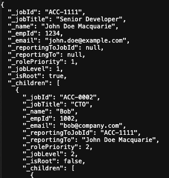
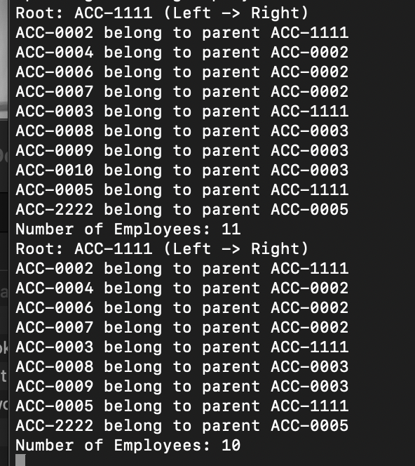
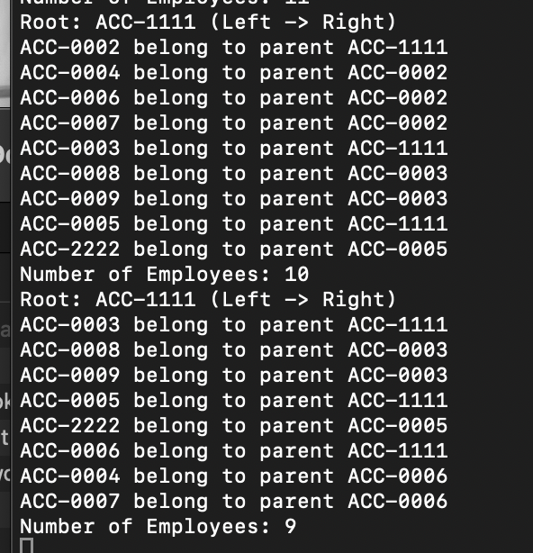

# Org Chart API
## Prerequisites
- npm (node package manager) installed
- Git for cloning the repository

## Installation
1. Clone the repository to your local machine
2. Navigate to the project directory
3. Install the dependencies:
```
npm install
```
4. Build the javascript files from the typescript files:
```
npm run build
```
5. Start the HTTP server:
```
npm start
```

6. Use Postman to make HTTP requests to the API endpoints:
- Upload a CSV file:
  `POST /upload`
- Create a new Employee in OrgChart:
  `POST /create`
- Update Employee Details in OrgChart:
  `POST /update`
- Promote Employee in OrgChart:
  `POST /promote`
- Resign Employee in OrgChart:
  `POST /resign`
- Get all employees in OrgChart:
  `GET /orgchart`

## Perform actions on live API
1. Upload CSV file

2. A New Root replacing existing root
```
{
    "job Id": "ACC-1111",
    "job title": "Senior Developer",
    "employee name": "John Doe",
    "email address": "john.doe@example.com",
    "employee id": 1234,
    "reporting to job id": null
}
```

- A New Employee reporting to Faralisa
```
{
    "job Id": "ACC-2222",
    "job title": "Developer",
    "employee name": "Victor",
    "email address": "victor@example.com",
    "employee id": 1567,
    "reporting to job id": "ACC-0005"
}
```

- Promote employee to report to root
```
{
    "job Id": "ACC-0005",
    "reporting to job id": null
}
```

- Updating John's name
```
{
    "job Id": "ACC-1111",
    "employee name": "John Doe Macquarie"
}
```

- Resigning an employee with no children (no replacement)
```
{
    "job Id": "ACC-0010"
}
```

- Resigning an employee and replacing it with it's children
```
{
    "job Id": "ACC-0002",
    "replacement job id": "ACC-0006"
}
```
